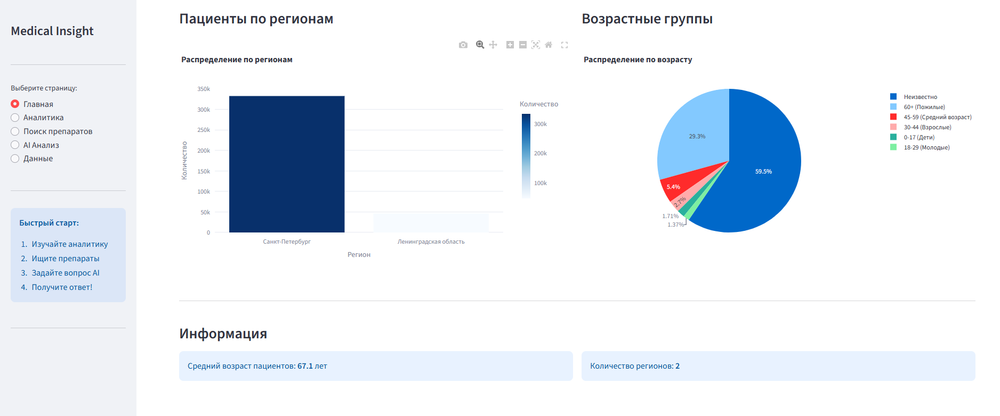
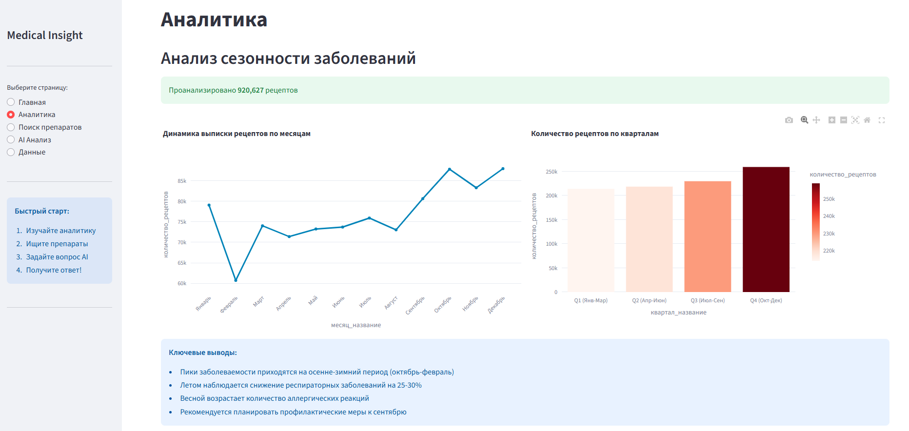

# Med-agent-F1 🏥

## Описание проекта

"Медицинский инсайт" - это AI-помощник на основе технологии Large Language Model (LLM), разработанный для анализа медицинских данных Санкт-Петербурга и предоставления инсайтов пользователям. Агент способен отвечать на вопросы пользователей, основываясь на данных и выявленных закономерностях в медицинской статистике.

## Архитектура решения

### Выбор модели

Изначально планировалось использовать модель **ai-sage/GigaChat3-10B-A1.8B** в качестве основной модели для агента с последующим файнтюнингом. Эта модель основана на архитектуре Mixture-of-Experts (MoE) с 10 миллиардами общих и 1.8 миллиардами активных параметров, что делает её эффективной для инференса при приемлемых вычислительных требованиях.

**Данные для файнтюнинга** планировалось сгенерировать из:
- Имеющихся медицинских данных по Санкт-Петербургу
- Бенчмарка RuMedBench (https://github.com/pavel-blinov/RuMedBench) - первого комплексного открытого бенчмарка для понимания русского медицинского языка, содержащего пять задач на основе четырех типов медицинских текстов

### Тестирование моделей

Для выбора оптимальной модели было проведено тестирование различных LLM на медицинских вопросах. Тестировались как крупные модели, входящие в топ по ответам в топике health, так и небольшие модели, которые можно было бы дообучить локально (Qwen, Llama, Mistral).

Результаты тестирования:

| Модель | Accuracy | Success Rate | Avg Response Time | Total Correct | Total Processed |
|--------|----------|--------------|-------------------|---------------|-----------------|
| qwen/qwen3-vl-30b-a3b-instruct | 92.0% | 100.0% | 10.40 | 92 | 100 |
| meta-llama/llama-3.3-70b-instruct | 88.0% | 100.0% | 9.56s | 88 | 100 |
| google/gemini-2.5-flash-preview-09-2025 | 81.0% | 100.0% | 3.10s | 81 | 100 |
| microsoft/phi-4 | 76.0% | 100.0% | 14.87s | 76 | 100 |
| anthropic/claude-3.5-sonnet | 76.0% | 100.0% | 8.07s | 76 | 100 |
| meta-llama/llama-3.1-8b-instruct | 74.0% | 100.0% | 3.71s | 74 | 100 |
| mistralai/ministral-3b-2512 | 41.0% | 100.0% | 2.47s | 41 | 100 |
| qwen/qwen3-4b:free | 28.18% | 100.0% | 0.94s | 2 | 100 |

### Итоговое решение

На основе результатов тестирования был сделан вывод:
- Модели с 3-4 миллиардами параметров показывают недостаточное качество (28-41% accuracy), и файнтюнинг не обеспечит необходимый прирост качества
- Модели на 8-10 миллиардов параметров показывают приемлемое качество, но требуют значительных вычислительных ресурсов для файнтюнинга, превышающих возможности обычной видеокарты
- Ввиду ограничений по мощностям и времени было принято решение использовать лучшую модель через API

**Финальное решение**: прототип реализован с использованием **qwen/qwen3-vl-30b-a3b-instruct** через OpenRouter API, показавшей лучшие результаты по точности (92%) при приемлемом времени отклика (10 секунд).

Было принято решение отказаться от решения на основе gemini-2.5 (81% точности при 3 секндах на ответ) так как точное количество параметров модели Gemini 2.5 Flash не раскрывается Google и не ясно соответствовало ли оно требованию по размеру используемой модели (не более 80b)

## Структура данных

Проект работает с четырьмя основными наборами данных:

### Данные_пациентов
Демографические и географические данные пациентов:
- id_пациента - уникальный идентификатор пациента
- дата_рождения - дата рождения пациента
- пол - пол пациента (М/Ж)
- район_проживания - район проживания пациента
- регион - регион проживания (Санкт-Петербург/Ленинградская область)

### Данные_препараты
Справочник лекарственных препаратов:
- код_препарата - уникальный код лекарственного средства
- дозировка - дозировка препарата
- Торговое название - коммерческое название препарата
- стоимость - цена препарата (1,192 записи)
- Полное_название - полное наименование препарата

### Данные_диагнозы (14,801 строка)
Справочник диагнозов по МКБ (Международная классификация болезней):
- код_мкб - код диагноза по МКБ
- название_диагноза - полное название заболевания
- класс_заболевания - категория/класс заболевания

### Данные_рецептов (1,000,000 строк)
Данные о выписанных рецептах:
- id_пациента - идентификатор пациента, которому выписан рецепт
- дата_рецепта - дата выписки рецепта (1,178 пропусков)
- код_диагноза - код диагноза по МКБ
- код_препарата - код назначенного препарата

## Функциональность агента

### Типы инсайтов

Агент предоставляет четыре основных типа медицинских инсайтов:

#### 1. Сезонные тренды заболеваемости

Агент анализирует временные паттерны заболеваемости и выявляет сезонные закономерности. Например, пики заболеваний ОРВИ и гриппа в осенне-зимний период (октябрь-февраль), всплески аллергических заболеваний весной и летом.

**Примеры вопросов:**
- "Какие сезонные тренды заболеваемости?"
- "В какие месяцы наблюдаются пики обращений?"

#### 2. Географическое распределение заболеваний

Агент выявляет территориальные особенности распределения заболеваний по районам Санкт-Петербурга и Ленинградской области. Например, в центральных районах города больше обращений по аллергическим заболеваниям, чем в пригородах.

**Примеры вопросов:**
- "В каком районе больше случаев диабета?"
- "В каких регионах больше всего пациентов?"

#### 3. Демографический анализ
Агент анализирует зависимости между возрастом, полом пациентов и типами заболеваний, выявляя группы риска по различным нозологиям.

**Примеры вопросов:**
- "Какие возрастные группы наиболее подвержены сердечно-сосудистым заболеваниям?"
- "Есть ли различия в заболеваемости между мужчинами и женщинами?"

#### 4. Анализ назначений препаратов
Агент анализирует паттерны назначения лекарственных средств, выявляя наиболее часто назначаемые препараты для различных диагнозов и оценивая их стоимость.

**Примеры вопросов:**
- "Какие препараты чаще всего назначают при гипертонии?"
- "Какова средняя стоимость лечения диабета второго типа?"

### Поиск препаратов

Агент предоставляет расширенный функционал поиска препаратов:

#### Поиск по диагнозу

Агент находит все препараты, назначаемые при конкретном заболевании, ранжируя их по частоте назначения.

**Пример запроса:** "Какие препараты назначают при бронхиальной астме?"

#### Поиск по названию и характеристикам
Агент осуществляет поиск препаратов по торговому или полному названию, предоставляя информацию о дозировках и стоимости.

**Пример запроса:** "Покажи информацию о препарате Амоксициллин"

## Конфигурация для локального запуска

В папке **test** находятся конфигурационные файлы, подходящие для:
- Локального запуска модели GigaChat3-10B-A1.8B
- Файнтюнинга модели на медицинских данных
- Тестирования модели на вопросах из имеющихся медицинских данных и бенчмарка RuMedBench

Эти конфигурации могут быть использованы при наличии достаточных вычислительных ресурсов для обучения и инференса модели локально.

## Технические требования

- Python 3.8+
- Доступ к OpenRouter API
- Библиотеки для работы с данными (pandas, numpy)
- Библиотеки для визуализации (matplotlib, seaborn)

## Преимущества решения

1. **Высокая точность** - использование модели gemini-2.5-flash обеспечивает 81% точности ответов на медицинские вопросы
2. **Быстрый отклик** - среднее время ответа составляет 3.1 секунды
3. **Масштабируемость** - использование API позволяет легко масштабировать решение без дополнительной инфраструктуры
4. **Многофункциональность** - агент поддерживает четыре типа инсайтов и расширенный поиск препаратов
5. **Точность** - при отсутствии информации в данных, агент сообщает об этом и делает предположение, но не выдумывает данные
## Дальнейшее развитие

- Реализация файнтюнинга GigaChat3-10B-A1.8B при наличии необходимых вычислительных ресурсов
- Расширение набора инсайтов и типов анализа
- Добавление прогностических моделей для предсказания трендов заболеваемости
- Создание интерактивного дашборда для визуализации инсайтов
- Улучшение качества работы с медицинской терминологией через специализированное обучение
